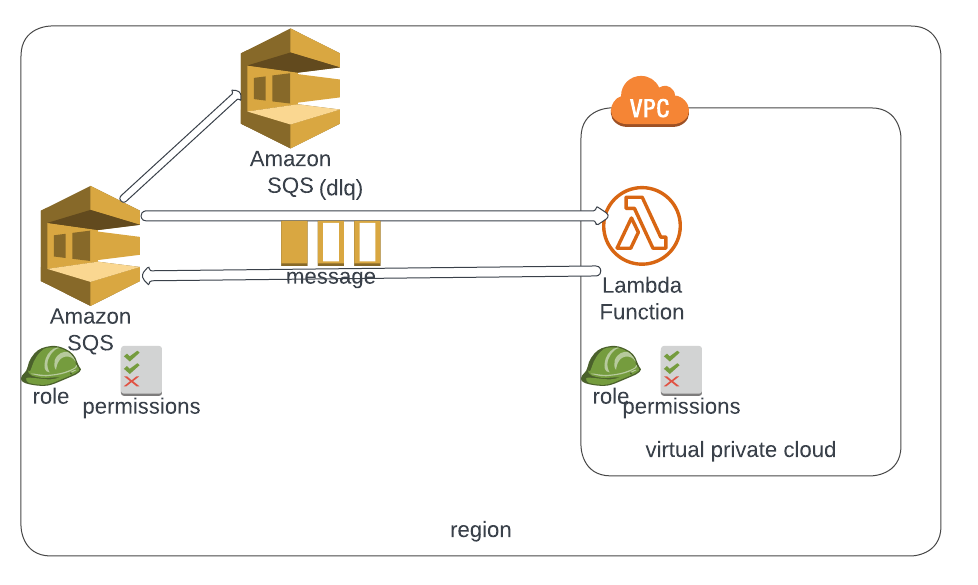

# Terraform code AWS Lambda and SQS 
The AWS Lambda function to process messages in an AWS SQS queue.As soon as a message lands in an AWS SQS, the Lambda function will trigger.The Lambda poll the message from the queue and process the message. 

>In below diagram:
1. The lambda function is defined in virtual private cloud(vpc).
2. The Lambda function has roles and permission to execute and access permission for sqs.
3. AWS SQS is type FIFO queue, which all the roles and permission to trigger the lambda function.
4. All the message in AWS SQS are encrypted , using KMS.
5. There is dead letter queue which is type FIFO.

